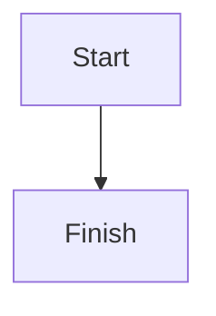

# Docs development

## Building the docs locally

Install the documentation dependencies from the repository root:

```bash
uv sync --extra dev
uv pip install -r docs/requirements.txt
```

Build the documentation with Zensical:

```bash
zensical build --config-file zensical.yml --strict
```

The generated site is written to `site/`. To preview the documentation while editing,
run:

```bash
zensical serve --config-file zensical.yml
```

## Mermaid diagrams

Mermaid code fences are supported through Zensical's native SuperFences
configuration. Use a standard fenced block:

````markdown

````

Do not use the old `mermaid2.fence_mermaid` formatter. That formatter was specific
to the previous MkDocs Material setup and is not compatible with Zensical's config
loader.

## Downloading the artifact of a dev version of the docs

The docs are only deployed for commits on the `main` branch. However, the docs are
built for every pull request and uploaded as an artifact named `docs-site`.

If you have an open pull request for your changes, open the docs workflow run,
download the `docs-site` artifact, unzip it, and open `index.html` in your browser.
