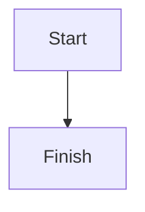

# Docs development

## Building the docs locally

Install the documentation dependencies from the repository root:

```bash
uv sync --extra dev
uv pip install -r docs/requirements.txt
```

Build the documentation with Zensical:

```bash
zensical build --config-file zensical.yml --strict
```

The generated site is written to `site/`. To preview the documentation while editing,
run:

```bash
zensical serve --config-file zensical.yml
```

## Mermaid diagrams

Mermaid code fences are supported through Zensical's native SuperFences
configuration. Use a standard fenced block:

````markdown

````

Do not use the old `mermaid2.fence_mermaid` formatter. That formatter was specific
to the previous MkDocs Material setup and is not compatible with Zensical's config
loader.

## Downloading the artifact of a dev version of the docs

The docs are deployed for commits on the `main` branch. Pull requests from branches
in the main repository also get a public preview at:

```text
https://umami-hep.github.io/puma/pr-<PR-number>/
```

The workflow posts the preview URL as a pull request comment and updates that
comment on later runs. The preview is removed automatically when the pull request
is closed. Forked pull requests still build the docs and upload the generated site
as an artifact named `docs-site`, but they do not publish a preview because GitHub
does not grant write permissions to those workflows.

If you need the artifact, open the docs workflow run, download the `docs-site`
artifact, unzip it, and open `index.html` in your browser.
