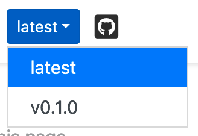
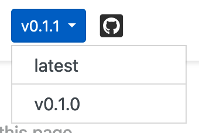
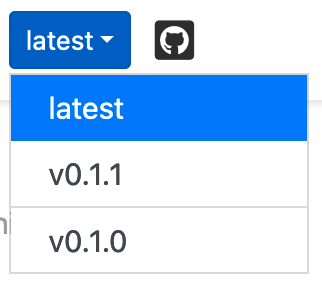

# Docs development

## Downloading the artifact of a dev version of the docs

When changing something in the `puma` documentation, you might find yourself in a
situation where you want to see if your changes have the intended effect.

The docs are only deployed for commits on the `main` branch. However, the docs are
built for _every_ commit, no matter on which branch, and are uploaded as an artifact.

This means that you can download the docs as a `.zip` file and then browser the html
files on your machine.

If you have an open pull request for your changes, you find the artifact like shown
below (click on the button that is marked with the red circle).
After downloading, unzip the file and open the `artifact/index.html` file in your browser.
You should then see the docs that you just downloaded.

## Adding a new version/tag to the docs

When publishing a new release of `puma`, we have to take care with the docs, since
it is built for each tag.

Let's say we want to update `puma` from version `0.1.0dev` to `0.1.1`. This means that
the version switcher in the docs currently looks like this:

In order to update the `puma` version in the docs correctly, please follow the steps
below (adapting the version numbers to your case).

1.  Bump the version in the `puma/__init__.py`, e.g. `0.1.0dev` → `0.1.1` and merge
    into the `main` branch via a PR. This means that the version does not contain "dev"
    any more - as a result of that, the switcher shows the version number instead of
    "latest", even if you click on "latest"

2.  Create release / push tag `v0.1.0`.
3.  Create another PR which adds a switcher entry with the new tag (this has to be
    done after the tag/release has been created, otherwise the build crashes since it
    wants to check out the tag even though it does not exist).
    In addition to that, rename the version in the `puma/__init__.py` like follows:
    `0.1.1` → `0.1.1dev`. The version switcher should now correctly display both the
    latest version and the new tag.

