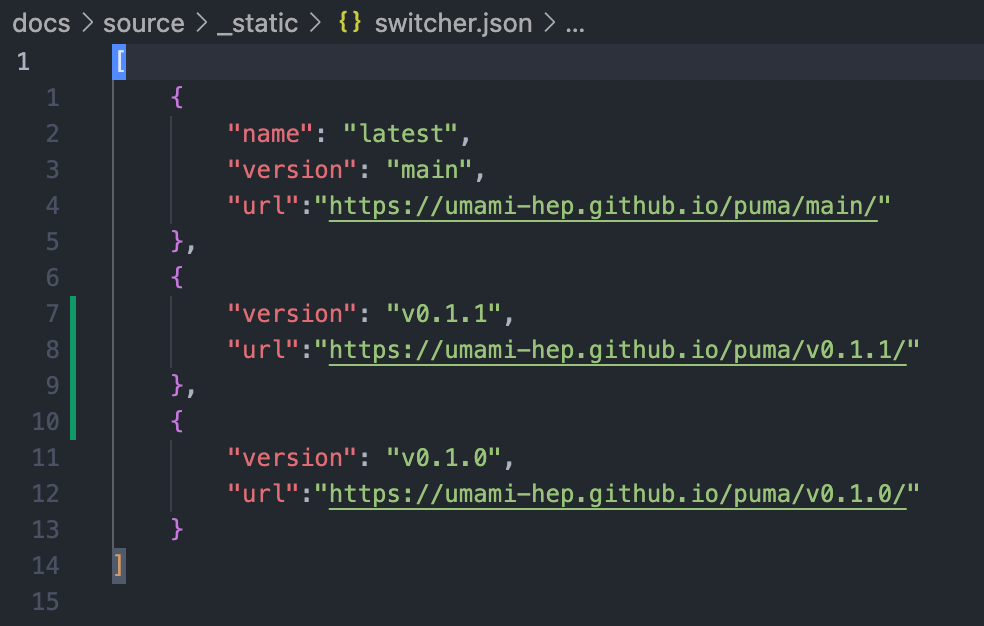
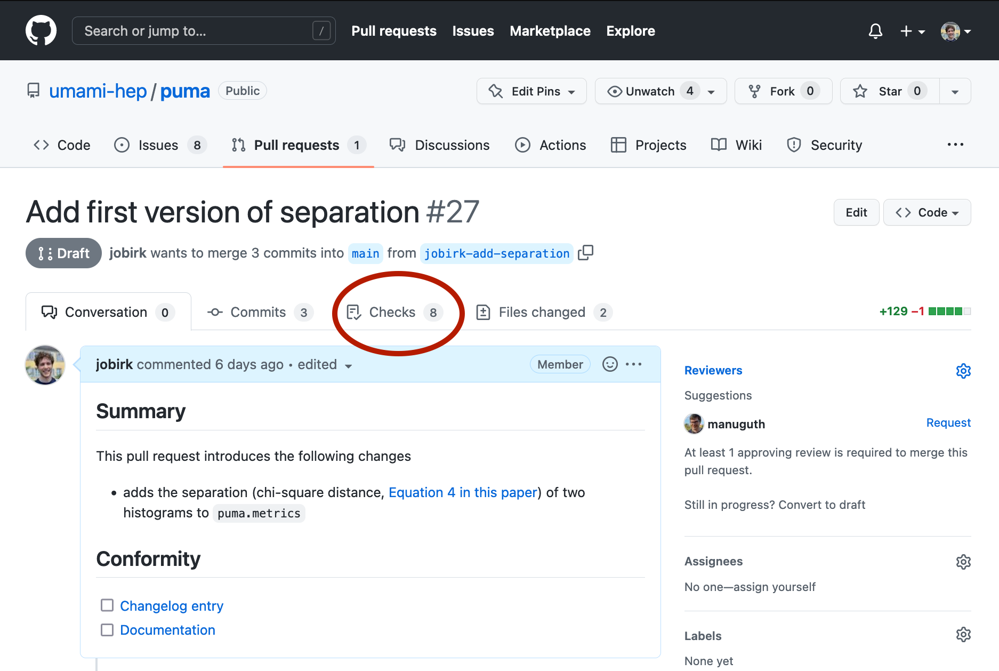
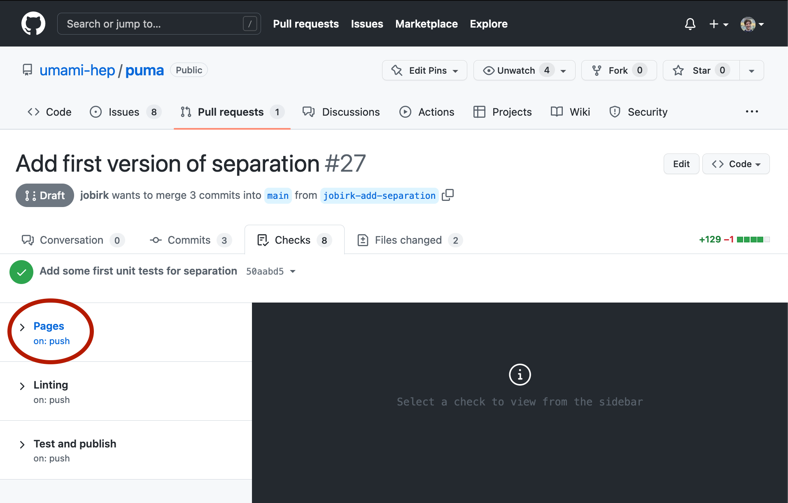
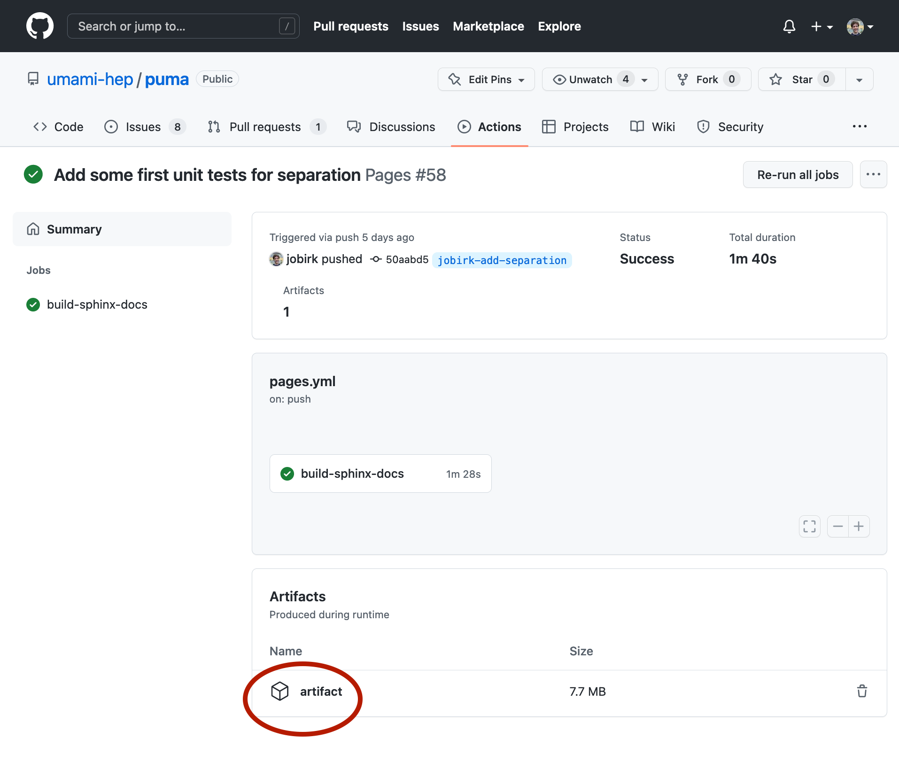

# Docs development

## Adding a new version/tag to the docs

To add the docs of a specific release/tag to the deployment on GitHub pages, just add
the corresponding version to the file `docs/source/_static/switcher.json`. The
corresponding job in the CI will then automatically build the docs for this release and
add it to the deployment.

## Downloading the artifact of a dev version of the docs

When changing something in the `puma` documentation, you might find yourself in a
situation where you want to see if your changes have the intended effect.

The docs are only deployed for commits on the `main` branch. However, the docs are
built for _every_ commit, no matter on which branch, and are uploaded as an artifact.

This means that you can download the docs as a `.zip` file and then browser the html
files on your machine.

If you have an open pull request for your changes, you find the artifact like shown
below (click on the button that is marked with the red circle).
After downloading, unzip the file and open the `artifact/index.html` file in your browser.
You should then see the docs that you just downloaded.

